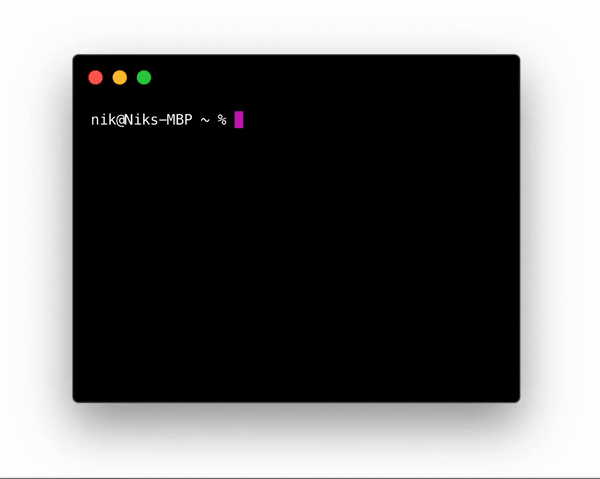

# totaltime
> A beautiful time calculation CLI 

<div align="center">
    
</div>

<!-- <p align="center">
    <a href="https://travis-ci.org/NikxDa/...">
        
    </a>
</p> -->

## Description

The `totaltime` tool provides a quick and easy way to complete timesheet calculations right in the terminal.

## Contents

- [Description](#description)
- [Installation](#installation)
- [Usage](#usage)
- [Command Line Arguments](#command-line-arguments)
- [License](#license)

## Installation

### Via RubyGems

```bash
$ gem install totaltime
```

### Via GitHub Packages

```bash
$ gem install totaltime --source "https://rubygems.pkg.github.com/nikxda"
```

## Usage

To use it, call `totaltime` in your terminal. The app will guide you from there.

```bash
$ totaltime
```

## Time Format

To specify durations, you can pass multiple formats to `totaltime`. It will always let you know whether your input is valid or not and convert it into a readable duration.

| Input Format | Example | Description |
| ------------ | ------ | ----------- |
| `hh:mm` | `01:30`, `2:5` | The default duration format. |
| `:mm` | `:30`, `:90` | Specify just minutes. |
| `hh` | `2`, `5` | Specify just hours. |
| `h.f` | `1.5`, `.5` | Specify hours and minutes as a float. |

## Command Line Arguments

This package supports several command line arguments as specified below.

| Option/s | Type | Default | Description |
| -------- | ---- | ------- | ----------- |
| `--help`, `-h` | `boolean` | - | Show a help document. |

## License

MIT